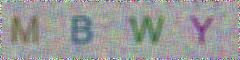

# Crack_CAPTCHA

> This program can generate the CAPTCHA’s recognize model which can be used to crack other. Actually, you can also called it CAPTCHA cracking model generator

## Which kind of CAPTCHA can it crack

The CAPTCHA code which **ONLY** contain the vocabulary

  

## How it work

1. generate some CAPTCHA code though `generator.py`, and write the data into `DB.db`
2. clean the code and split the letter by `clean.py`
3. train the model and reconstruct the data in `train.py`
4. main program located in `get_model.py`

the **arithmetic** use to cluster is `the normal KNN`

## How to use it

start the `get_model.py`, and input the `number of code you wanna generate`, then, after a while, It will output a model called `model.m`. and you can use this model to crack the other CAPTCHA

for the variable, I recommend you to input 1000-2000, it will make a 94% rate of accuracy model.

## TODO

change a better arithmetic to increase the accuracy,

and change the generate construction to speed up the training time

## DEMO

